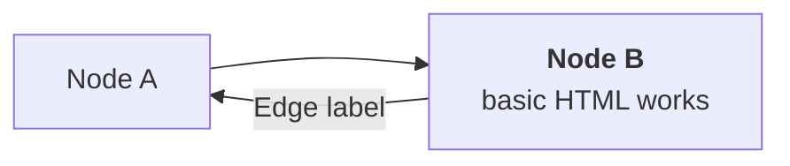

# README
## Making Good READMEs
- Tim Fraser

Good, clear READMEs are vital to team code collaboration, because otherwise (1) no one else knows what you did and (2) you too will forget what you did within 2 weeks. Good READMEs usually include a few things:

- **Bullet Points** (in Markdown). **Bolding** and `code format` helpful. [Examples here](https://docs.github.com/en/get-started/writing-on-github/getting-started-with-writing-and-formatting-on-github/basic-writing-and-formatting-syntax).
- **Tables** (in Markdown). Great for making codebooks (eg. "pollutant == 98 means CO2 Equivalent, or CO2e for short" could be succinctly written in a table with 3 columns: `pollutant`, `definition`, and `abbreviation`. [Examples here.](https://www.markdownguide.org/extended-syntax/)
- **Code Excerpts** (in Markdown). Describes your coding process step-by-step.
- **Flowcharts** (in `mermaid`). Visualizes your coding process, or the inputs and outputs of a function. [Examples here](http://mermaid.js.org/syntax/flowchart.html): 
- **Numbered Sections** (in Markdown). Helps organize your README.

But where do I learn all of this? I recommend dedicating 30 minutes with coffee to reading these 3 guides: ([markdown](https://docs.github.com/en/get-started/writing-on-github/getting-started-with-writing-and-formatting-on-github/basic-writing-and-formatting-syntax), [mermaid](http://mermaid.js.org/syntax/flowchart.html), and [tables](https://www.markdownguide.org/extended-syntax/). Make a new `.md` file in the `/docs` folder of your github repository and try it out. Here are a couple of quick examples too.

You can make a table quickly in a Github README like so - (look at the raw code for this file). See [more tutorials here](https://www.markdownguide.org/extended-syntax/).

| Left-justified  | Centered       |  Right-justified |           
| :---            | :-----------:  | ---------------: |
| topic           | topic          | topic            |
| topic           | topic          | topic            |

You can make a code excerpt quickly in a Github README using the `` tags. Always specify the language (eg. `r` to get Github to interpret it correctly. Github generally won't run the code itself (`mermaid` is an exception), but it will highlight the syntax appropriately.

```r
# I'm an example code chunk
library(dplyr)
mydata %>% head()
```

You can make a `mermaid` flowchart quickly in a Github README like so - (look at the raw code for this file). I personally make my flowcharts online in [mermaid.live](https://mermaid.live/) first, then copy my code over into the Github README, so I don't have to preview it multiple times. See [tutorials here](http://mermaid.js.org/syntax/flowchart.html)


